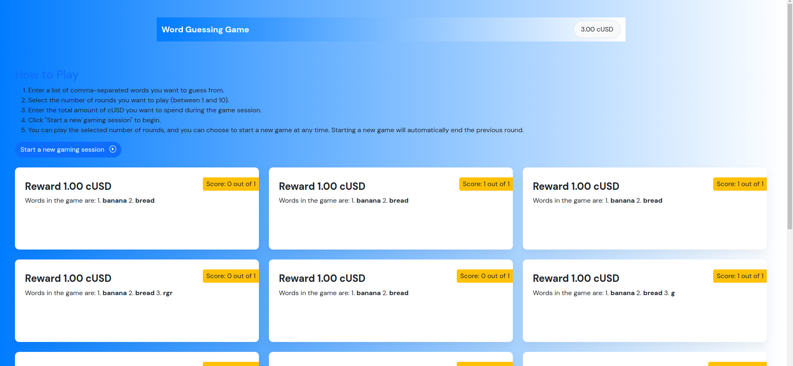
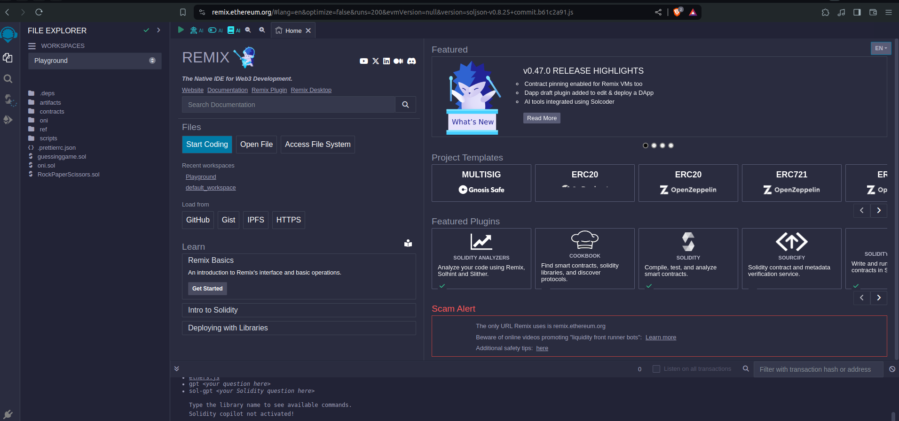

# Word Guessing Game: A Comprehensive ReadMe

This ReadMe provides a comprehensive guide to the Word Guessing Game, a decentralized application (dApp) built on the Celo blockchain. It covers installation, usage, key learnings during development, and insights for creating similar dApps.

## Introduction
- **App Name:** Word Guessing Game
- **Problem Solved:** Provides a fun way to learn about blockchain technology while potentially winning cUSD tokens.
- **Target Audience:** Anyone interested in blockchain gaming and exploring dApps.
- **Value Proposition:** Offers a user-friendly interface to experience decentralized applications and potentially earn cryptocurrency.

## How to Play

### To Test the Live Game go to 
```
https://oni1997.github.io/cput-hacka
```

### First Timer
### Returning Player

1. Enter a list of comma-separated strings you want to guess from.
2. Enter how many rounds you would like to play.
3. Specify the total amount of cUSD you want to spend in the session.
4. You can play the number of rounds you selected, and you may choose to start a new game. This will automatically end the previous round.


1. If you have an ongoing set of rounds, you may continue or choose to start a new game.

### Requirements
- **Switch to Alfajores Testnet:** Switch to the Alfajores testnet in the Celo Extension Wallet.
- **Celo Extension Wallet:** Install the [CeloExtensionWallet](https://chrome.google.com/webstore/detail/celoextensionwallet/kkilomkmpmkbdnfelcpgckmpcaemjcdh?hl=en) from the Google Chrome Store.

- **Create a Wallet:** Create a wallet using the Celo Extension Wallet.


- **Get Test Tokens:** Go to [https://celo.org/developers/faucet](https://celo.org/developers/faucet) and obtain tokens for the Alfajores testnet.


## Key Points I Learned While Building This
- **Event Logging:** Utilizing event logging for better transparency and tracking within the contract.
- **Handling ERC20 Tokens:** Properly managing ERC20 token transactions within the contract, avoiding simultaneous charges in both Celo and cUSD.
  
## Tech Stack:
- **Frontend:** HTML, CSS, JavaScript (Bootstrap)
- **Smart Contract:** Solidity
- **Blockchain:** Celo
- **Web3.js Library:** Interact with the Celo blockchain.
- **@celo/contractkit:** Simplify interaction with Celo smart contracts.
- **bignumber.js Library:** Advanced math operations for handling cryptocurrency values.

# Install
```
npm install
```
or 
```
yarn install
```

# Start
```
npm run dev
```

# Build
```
npm run build
```

# Usage
1. Install the [CeloExtensionWallet](https://chrome.google.com/webstore/detail/celoextensionwallet/kkilomkmpmkbdnfelcpgckmpcaemjcdh?hl=en) from the Google Chrome Store.


2. Create a wallet.


3. Go to [https://celo.org/developers/faucet](https://celo.org/developers/faucet) and get tokens for the Alfajores testnet.


4. Switch to the Alfajores testnet in the Celo Extension Wallet.

# Solidity
- https://remix.ethereum.org/

